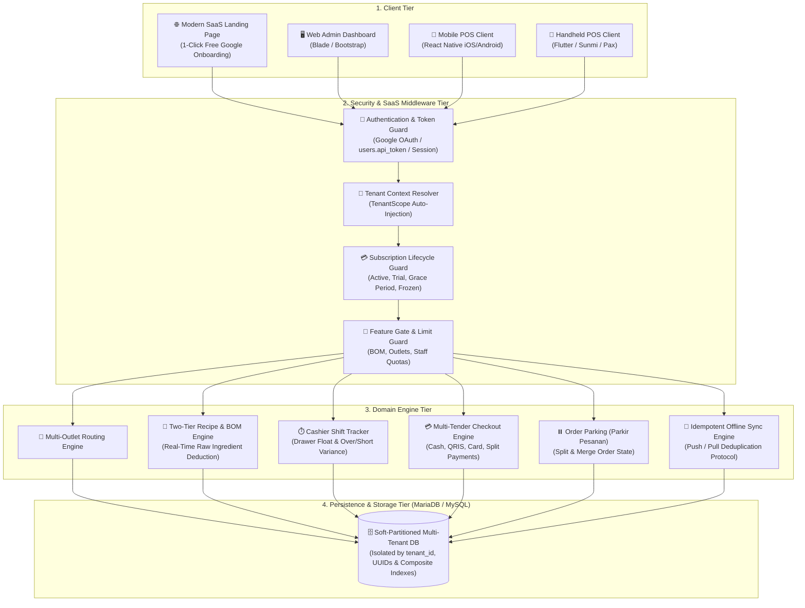
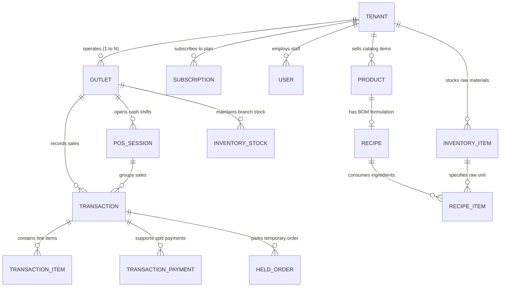
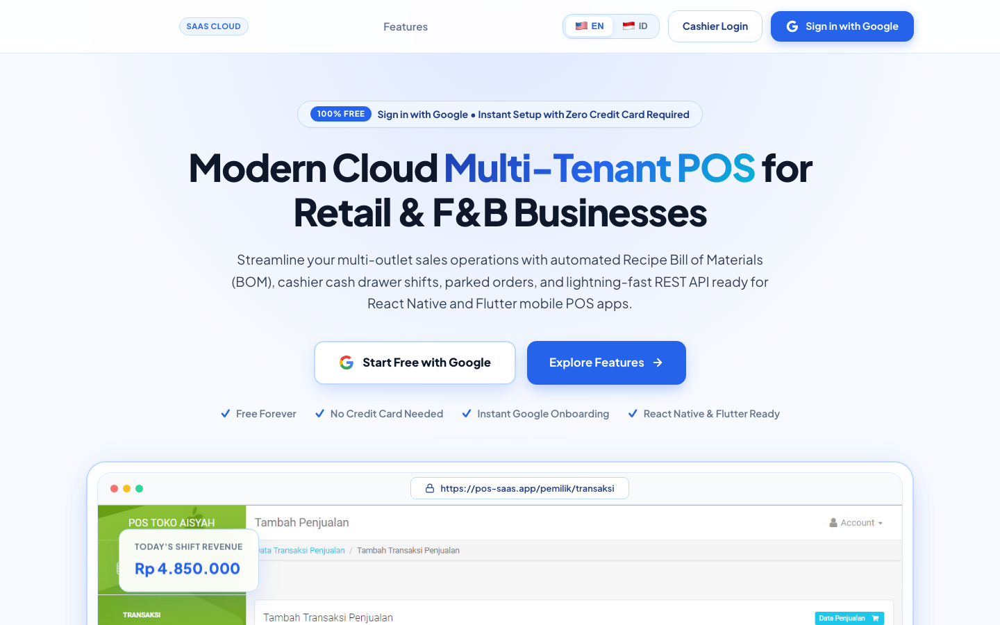

<h1 align="center">🛍️ Enterprise Multi-Tenant SaaS Point of Sale (POS)</h1>

<p align="center">
  <b>A high-throughput, resilient Multi-Tenant SaaS Point of Sale (POS) engine designed for retail chains, franchises, and F&B operations.</b><br>
  Engineered with a single-database soft-partitioned multi-tenancy model, atomic Bill of Materials (BOM) inventory deductions, idempotent offline-first mobile sync for <b>React Native</b> & <b>Flutter</b>, and zero-trust supervisor authorization.
</p>

<p align="center">
  
  
  
  
  
  
  
  
  
</p>

---

## 👨‍💻 Engineering Highlights & Senior Competencies

This repository is designed not merely as a functional retail POS, but as an **architectural case study** addressing the complex challenges of distributed retail systems:

1. **Enterprise Multi-Tenancy**: Automated query isolation using Eloquent Global Scopes (`TenantScope`) and traits (`BelongsToTenant`), preventing cross-tenant data leaks (anti-IDOR) without the infrastructure overhead of database-per-tenant architectures.
2. **ACID Financial Integrity & Concurrency**: Atomic checkout workflows (`DB::transaction`) guaranteeing stock deduction, financial ledger entry, and cashier float updates either succeed together or rollback completely.
3. **Distributed Offline-First Synchronization**: Idempotent batch sync protocol for mobile POS terminals (`MobileSyncController`) utilizing client-generated UUID deduplication to eliminate duplicate charges in spotty network environments.
4. **Resilient SaaS Lifecycle State Machine**: Six-stage subscription lifecycle (`trialing`, `active`, `past_due`, `grace_period`, `frozen`, `cancelled`) with graceful degradation via `BlockFrozenWrite` middleware—preserving historical accounting read access while halting billable write paths.
5. **Zero-Trust Security & Auditability**: Two-person integrity rule for high-risk operations (voids, large discounts) via 6-digit Supervisor PIN authorization, issuing ephemeral 15-minute authorization tokens logged to a tamper-evident audit trail (`AuthorizationLog`).
6. **Automated Continuous Integration**: Comprehensive GitHub Actions pipeline testing PHP syntax (`php -l`), migrations, seeders, and PHPUnit suites against a dedicated MariaDB 10.5 service container.

---

## 📑 Table of Contents

1. [System Architecture](#-system-architecture)
2. [Architecture Decision Records (ADRs)](#-architecture-decision-records-adrs)
3. [Concurrency, Data Consistency & Financial Integrity](#-concurrency-data-consistency--financial-integrity)
4. [Security Posture & Zero-Trust Defense](#-security-posture--zero-trust-defense)
5. [Data Model & Entity-Relationship Architecture](#-data-model--entity-relationship-architecture)
6. [Database Indexing & Query Performance](#-database-indexing--query-performance)
7. [Mobile REST API V1 (React Native & Flutter)](#-mobile-rest-api-v1-react-native--flutter)
8. [SaaS Subscription Lifecycle & Feature Gating](#-saas-subscription-lifecycle--feature-gating)
9. [DevOps & CI/CD Pipeline](#-devops--cicd-pipeline)
10. [Quick Start Guide (Docker)](#-quick-start-guide-docker)
11. [Default Authentication Credentials](#-default-authentication-credentials)
12. [Manual Environment Setup (Native)](#-manual-environment-setup-native)
13. [Frequently Asked Questions & Architectural Deep-Dives](#-frequently-asked-questions--architectural-deep-dives-faq)
14. [Visual Interface Showcase](#-visual-interface-showcase)

---

## 🏗️ System Architecture

The platform is structured into four distinct decoupled tiers, ensuring clean separation of concerns, scalability, and strict security boundary enforcement:



---

## 📐 Architecture Decision Records (ADRs)

Senior engineering requires clear articulation of trade-offs and rationale. Below are key design decisions made for this system:

### 📄 ADR-001: Soft-Partitioned Multi-Tenancy vs Database-per-Tenant
* **Context**: The platform needs to host thousands of small-to-medium retail merchants cost-effectively while strictly isolating their commercial transactions.
* **Decision**: Adopt a **Single-Database Shared-Schema** model with automatic query scoping via Eloquent's `TenantScope` and the `BelongsToTenant` model trait.
* **Trade-off Analysis**:
  * *Pros*: Near-zero cost per tenant, simple zero-downtime database migrations, pooled database connections without per-tenant pool exhaustion, straightforward cross-tenant aggregate analytics for SaaS platform admins.
  * *Cons & Mitigations*: Risk of noisy-neighbor queries and accidental cross-tenant data access. Mitigated by enforcing global query scopes, composite indexing on `(tenant_id, ...)`, and integration tests asserting multi-tenant query isolation.

### 📄 ADR-002: Idempotent Batch Sync with Client-Generated UUIDs
* **Context**: Cashier tablets operate in physical retail stores subject to unstable Wi-Fi or intermittent cellular networks. Mobile terminals retry synchronization requests upon HTTP timeouts, creating risks of double charges and duplicate inventory deductions.
* **Decision**: Implement idempotent offline synchronization in `MobileSyncController` using client-supplied `offline_id` UUIDs.
* **Trade-off Analysis**:
  * *Pros*: Network retries are completely safe; the engine checks for existing transactions tagged with `offline_id:{$offlineId}` and immediately returns HTTP 200 with the existing record (`status: already_synced`).
  * *Cons & Mitigations*: Requires client mobile applications (React Native / Flutter) to generate persistent UUIDs before pushing offline queues.

### 📄 ADR-003: Graceful Subscription Degradation (`BlockFrozenWrite`)
* **Context**: When a tenant's billing cycle lapses, immediate hard lockouts (e.g. HTTP 403 / 500) disrupt store operations and prevent store owners from reconciling previous days' accounts or exporting tax data.
* **Decision**: A progressive 6-stage lifecycle (`trialing` $\rightarrow$ `active` $\rightarrow$ `past_due` $\rightarrow$ `grace_period` $\rightarrow$ `frozen` $\rightarrow$ `cancelled`). In the `frozen` state, the `BlockFrozenWrite` middleware intercepts state-mutating requests (POST, PUT, DELETE) with HTTP 402/403 while permitting read-only GET queries.
* **Trade-off Analysis**:
  * *Pros*: High customer trust, uninterrupted accounting compliance, clear UX messaging prompting subscription renewal without data hostage scenarios.
  * *Cons & Mitigations*: Requires strict distinction between read and write endpoints across both web dashboard routes and mobile API controllers.

### 📄 ADR-004: Two-Tier Bill of Materials (BOM) Decoupling
* **Context**: Food & beverage (F&B) and custom retail items are sold as menu items (e.g., *Caramel Macchiato* or *Gift Hamper*), but raw inventory is consumed in raw units (espresso beans in grams, milk in ml, syrup in pumps).
* **Decision**: Decouple sellable `Product` records from raw `InventoryItem` stock, bound via `Recipe` and `RecipeItem` formulations.
* **Trade-off Analysis**:
  * *Pros*: Accurate cost-of-goods-sold (COGS) tracking, automated stock depletion at physical outlet locations upon checkout, and prevention of inventory drift.
  * *Cons & Mitigations*: Checkout requires multi-table lookups. Mitigated by eager-loading recipe items and running calculations inside atomic database transactions.

---

## ⚡ Concurrency, Data Consistency & Financial Integrity

Point-of-sale systems must maintain zero discrepancy in financial ledgers and stock counts.

### 1. Atomic Checkout & Stock Deductions
Every checkout transaction executes within an isolated database transaction (`DB::transaction`):
```php
DB::transaction(function () use (&$transaction, $user, $outlet, $session, $trxNumber, $processedItems, $paymentsData, ...) {
    // 1. Persist master transaction record
    $transaction = Transaction::create([...]);

    // 2. Persist line items & atomically deduct raw materials
    foreach ($processedItems as $pItem) {
        TransactionItem::create([...]);
        if ($pItem['track_stock'] && $pItem['inventory_item_id']) {
            $this->deductStock($pItem['inventory_item_id'], $outlet->id, $pItem['quantity'], $transaction, $user->id);
        }
    }

    // 3. Record multi-payment split tender (Cash, QRIS, Card)
    foreach ($paymentsData as $p) {
        TransactionPayment::create([...]);
    }
});
```
If any step fails (e.g., payment gateway timeout, constraint violation), the entire database state rolls back cleanly.

### 2. Cash Drawer Shift Reconciliation & Variance Ledger
The system tracks cash movement throughout each cashier session:
$$\text{Expected Cash} = \text{Opening Float} + \text{Cash In} - \text{Cash Out} + \text{Total Cash Sales}$$
$$\text{Cash Variance (Over / Short)} = \text{Actual Cash Count} - \text{Expected Cash}$$
Any variance ($\neq 0$) is flagged in the audit log for store manager investigation before shift sign-off.

---

## 🛡️ Security Posture & Zero-Trust Defense

### 1. Anti-IDOR Defense-in-Depth
In a multi-tenant shared database, traditional query calls like `Product::find($id)` are vulnerable to Insecure Direct Object References (IDOR). This system mitigates IDOR at the framework layer:
* **Eloquent Global Scopes**: `TenantScope` intercepts every Eloquent query and automatically appends `WHERE tenant_id = :tenant_id`.
* **Middleware Boundary**: `EnsureTenantScope` verifies that the incoming request has resolved a verified tenant context before routing to domain handlers.

### 2. Ephemeral Supervisor PIN Authorization
High-risk store operations (such as item voids, cash drawer manual open, or discounts exceeding cashier limits) enforce a two-person rule:
1. The cashier enters the **6-digit Supervisor PIN**.
2. The server verifies the PIN and generates a cryptographically random UUID token with a **15-minute TTL**.
3. The cashier submits the void request including the authorization token.
4. An immutable audit record is saved in `authorization_logs` detailing cashier ID, supervisor ID, action type, client IP, and justification.

---

## 📊 Data Model & Entity-Relationship Architecture



---

## 🚀 Database Indexing & Query Performance

High-traffic retail terminals process hundreds of transactions per hour. The database schema incorporates strategic indexes:

| Table | Index Columns | Purpose & Query Target |
| :--- | :--- | :--- |
| `transactions` | `(tenant_id, outlet_id, created_at)` | Fast time-series aggregation for shift reports and sales analytics |
| `transactions` | `(tenant_id, transaction_number)` | $O(1)$ unique receipt lookup by barcode/QR code scan |
| `inventory_stocks` | `(tenant_id, outlet_id, inventory_item_id)` | Unique branch stock resolution and race-condition prevention |
| `pos_sessions` | `(tenant_id, outlet_id, status)` | Fast active-shift lookup (`WHERE status = 'open'`) |
| `authorization_logs` | `(tenant_id, uuid, status, created_at)` | Sub-millisecond supervisor PIN token validation |

### Mitigating N+1 Query Degradation
All API index endpoints utilize targeted eager-loading to prevent N+1 query cascades:
```php
$query = Transaction::where('status', 'completed')
    ->with(['items', 'payments.paymentMethod', 'user'])
    ->latest('id');
```

---

## 📱 Mobile REST API V1 (React Native & Flutter)

A dedicated, lightweight JSON REST API under `/api/v1/` powers mobile POS terminals and handheld devices.

### Supported Mobile Clients
* ⚛️ **React Native** (iOS & Android POS tablets, iPads, mobile checkout)
* 🐦 **Flutter** (Cross-platform mobile POS, Sunmi / Pax / Android dedicated smart terminals)

### Endpoints Overview

| Domain | Method | Endpoint | Description & Security Guard |
| :--- | :--- | :--- | :--- |
| **Auth** | `POST` | `/api/v1/auth/login` | Authenticate cashier, returns `api_token` and outlets |
| **Auth** | `GET` | `/api/v1/auth/me` | Retrieve profile and current subscription status |
| **Auth** | `GET` | `/api/v1/auth/outlets` | List authorized outlets for cashier staff |
| **Auth** | `POST` | `/api/v1/auth/verify-supervisor-pin` | Verify 6-digit Supervisor PIN for voids/discounts |
| **Catalog** | `GET` | `/api/v1/categories` | List product categories |
| **Catalog** | `GET` | `/api/v1/products` | Retrieve sellable items with variants and recipe flags |
| **Shifts** | `GET` | `/api/v1/shifts/current` | Check active shift status and opening float balance |
| **Shifts** | `POST` | `/api/v1/shifts/start` | Open a cashier shift with starting cash balance |
| **Shifts** | `POST` | `/api/v1/shifts/close` | Submit actual cash count and calculate cash variance |
| **Checkout** | `POST` | `/api/v1/orders/checkout` | Process order, split tender, and deduct raw materials |
| **Held Orders**| `GET` | `/api/v1/held-orders` | List parked orders for the branch |
| **Held Orders**| `POST` | `/api/v1/held-orders` | Park an active order with customer/table note |
| **Held Orders**| `POST` | `/api/v1/held-orders/{id}/resume`| Resume a parked order for final payment |
| **Offline Sync**| `GET`| `/api/v1/sync/pull` | Download catalog & stock changes for local mobile cache |
| **Offline Sync**| `POST`| `/api/v1/sync/push` | Idempotent upload of transactions captured offline |

### Sample Checkout Payload (`POST /api/v1/orders/checkout`)
```json
{
  "outlet_id": 1,
  "pos_session_id": 1,
  "customer_name": "Walk-in Guest",
  "items": [
    {
      "product_id": 1,
      "variant_id": 2,
      "quantity": 2,
      "discount_amount": 0
    }
  ],
  "payments": [
    {
      "payment_method_id": 1,
      "amount": 50000,
      "reference_number": "CASH-FLOAT-01"
    }
  ]
}
```

---

## 🏷️ SaaS Subscription Lifecycle & Feature Gating

The engine enforces dynamic quotas and module availability across four tiers:

| Feature / Quota | Free Trial | Starter | Professional | Enterprise |
| :--- | :---: | :---: | :---: | :---: |
| **Duration / Billing** | 14 Days (Free) | Rp 99.000 / mo | Rp 249.000 / mo | Custom Contract |
| **Physical Outlets** | 1 Outlet | 1 Outlet | 3 Outlets | Unlimited |
| **Cashier / Staff Seats** | Up to 2 Users | Up to 5 Users | Up to 15 Users | Unlimited |
| **Product Master Quota** | 100 Products | 500 Products | Unlimited | Unlimited |
| **Two-Tier Recipe / BOM**| ❌ Disabled | ❌ Disabled | ✅ Included | ✅ Included |
| **Offline Mobile Sync** | Basic | Basic | ✅ High Priority | ✅ Dedicated Channel |
| **Supervisor PIN Voids** | ❌ Disabled | ✅ Included | ✅ Included | ✅ Granular Roles |

---

## 🔄 DevOps & CI/CD Pipeline

The repository features an automated multi-stage GitHub Actions workflow ([`.github/workflows/ci.yml`](file:///.github/workflows/ci.yml)):

```
Push / PR ──▶ [1. PHP Syntax Linting (php -l)]
          ──▶ [2. MariaDB 10.5 Service Health Check]
          ──▶ [3. Environment & Key Setup]
          ──▶ [4. Fresh Migrations & Multi-Tenant Seeders]
          ──▶ [5. PHPUnit Test Suite Execution]
          ──▶ [6. Docker Compose Build & Config Validation]
```

---

## 🐳 Quick Start Guide (Docker)

> **💡 Zero Local PHP or MariaDB Configuration Required**  
> Runs entirely in isolated containers. MariaDB and Laravel spin up, migrate, and seed all SaaS demo records automatically with a single command.

```bash
# 1. Clone the repository
git clone https://github.com/mfarim/laravel-pos.git
cd laravel-pos

# 2. Launch application & MariaDB containers
docker compose up -d

# 3. Access web dashboard in your browser:
# 👉 http://localhost:8000
```

---

## 🔑 Default Authentication Credentials

Pre-seeded credentials covering each operational level:

| Role | Email / Username | Password | Default PIN | Operational Scope |
| :--- | :--- | :--- | :---: | :--- |
| **Platform Super Admin** | `superadmin@pos.id` (`superadmin`) | `AdminAi123` | `999999` | Global SaaS management: tenant provisioning, plan tiers, system health. |
| **Store Owner (Tenant)** | `admin@aisyah.com` (`admin`) | `AdminAi123` | `123456` | Store governance: Outlets, staff, BOM formulations, pricing, financial ledgers. |
| **Cashier (Outlet Staff)** | `kasir@aisyah.com` (`penjaga`) | `member123` | `654321` | Terminal operations: Cash shifts, sales checkout, parked orders, receipts. |

---

## 💻 Manual Environment Setup (Native)

For bare-metal or local non-Docker development:
* **PHP**: 7.1 to 7.4 (Required extensions: `pdo_mysql`, `mbstring`, `gd`, `zip`, `xml`, `bcmath`, `json`, `curl`)
* **Composer**: 2.2 LTS
* **Database**: MySQL 5.7+ or MariaDB 10.3+

```bash
# 1. Environment file setup
cp .env.example .env

# 2. Install dependencies
composer install

# 3. Generate application secret key
php artisan key:generate

# 4. Execute database migrations and seed default SaaS data
php artisan migrate --seed

# 5. Start development server
php artisan serve
```

---

## ❓ Frequently Asked Questions & Architectural Deep-Dives (FAQ)

<details>
<summary><b>1. How does the system guarantee tenant data isolation without separate databases?</b></summary>
<br>
All tenant-scoped models use the <code>BelongsToTenant</code> trait. When a cashier or store owner authenticates, their <code>tenant_id</code> is bound to the service container. Eloquent's <code>TenantScope</code> automatically injects <code>WHERE tenant_id = ?</code> into all read and write queries, preventing accidental cross-tenant data leaks (anti-IDOR).
</details>

<details>
<summary><b>2. How does offline sync prevent double stock deductions when connection drops?</b></summary>
<br>
Mobile clients tag offline cart transactions with a client-generated UUID (<code>offline_id</code>). When the device re-establishes connectivity and pushes the queue to <code>/api/v1/sync/push</code>, the server inspects previous transaction references before creating records. If the <code>offline_id</code> was already processed, the engine safely skips stock deduction and returns the existing transaction ID.
</details>

<details>
<summary><b>3. What happens when a tenant's subscription expires during store hours?</b></summary>
<br>
The tenant enters a 7-day <code>grace_period</code> with warning banners. If renewal fails, the status moves to <code>frozen</code>. The <code>BlockFrozenWrite</code> middleware blocks any new sales checkout or mutations (HTTP 402/403) while maintaining full read access so store owners can extract financial reports and tax records.
</details>

<details>
<summary><b>4. How does the Two-Tier Recipe BOM engine handle variant ingredient adjustments?</b></summary>
<br>
Products can have multiple variants (e.g. <i>Large</i> vs <i>Regular</i>). Each variant links to a <code>Recipe</code> with itemized raw ingredient quantities. During checkout, the deduction engine multiplies line quantities by the recipe formulation ratio and records detailed entries in the <code>stock_movements</code> ledger.
</details>

---

## 📸 Visual Interface Showcase

### 1. Modern Multi-Tenant SaaS Landing Page


### 2. Merchant Authentication & Role Login


### 3. POS Cashier Sales Terminal & Cart


### 4. Purchasing, Restock & Raw Materials


### 5. Master Product Catalog & Variant Data


### 6. Revenue Analytics & Shift Reporting


---

<p align="center">
  Crafted with rigorous engineering principles for high-reliability, multi-tenant retail operations.
</p>
