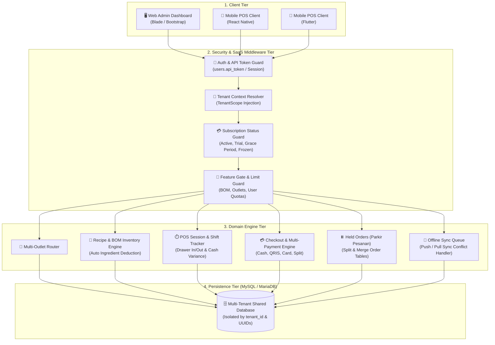
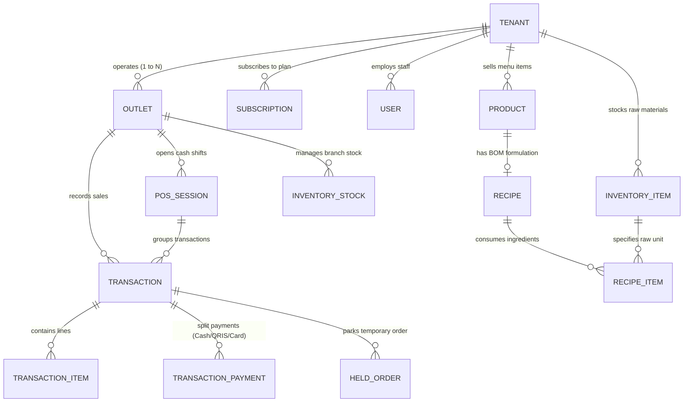

<h1 align="center">🛍️ Multi-Tenant SaaS Point of Sale (POS)</h1>

<p align="center">
  A modern, high-performance Multi-Tenant Point of Sale (POS) & Store Management Engine built with Laravel 5.5 and PHP 7.4. Designed for scale—supporting Multi-Outlet branches, SaaS Subscription Billing, Two-Tier Recipe/BOM Inventory Deductions, Shift Management, and an Offline-First REST API built for <b>React Native</b> and <b>Flutter</b> mobile POS apps.
</p>

<p align="center">
  
  
  
  
  
  
  
</p>

---

## 📑 Table of Contents
1. [System Architecture](#-system-architecture)
2. [Data & Multi-Tenancy Model](#-data--multi-tenancy-model)
3. [Key SaaS & POS Features](#-key-saas--pos-features)
4. [Mobile REST API V1 (React Native & Flutter)](#-mobile-rest-api-v1-react-native--flutter)
5. [SaaS Subscription Plans](#-saas-subscription-plans)
6. [Quick Start with Docker (Recommended)](#-quick-start-with-docker-recommended)
7. [Default Login Credentials](#-default-login-credentials)
8. [Manual Setup Guide (Without Docker)](#-manual-setup-guide-without-docker)
9. [Useful Commands](#-useful-commands)
10. [FAQ & Troubleshooting](#-frequently-asked-questions--troubleshooting-faq)
11. [Screenshots](#-screenshots)

---

## 🏗️ System Architecture

The platform uses a **single-database multi-tenant architecture** with automatic query isolation via Eloquent Global Scopes (`TenantScope`). Business rules, subscription lifecycle checks, and feature gates are enforced at the middleware layer before reaching core domain services.



---

## 📊 Data & Multi-Tenancy Model

Every commercial record (catalog, inventory, transactions, shifts, orders) is strictly bound to a `tenant_id` and outlet. Foreign key constraints, cascading deletions, and indexed lookups ensure optimal query speeds and data hygiene.



---

## ✨ Key SaaS & POS Features

### 🏢 1. True Multi-Tenancy & Multi-Outlet Support
- **Isolated Tenant Data**: Every tenant operates in their own virtual space using `TenantScope` and the `BelongsToTenant` trait.
- **Branch/Outlet Management**: Supports single-location merchants up to enterprise chains with multiple physical branches and individual inventory balances.

### 💳 2. Subscription Billing & Grace Period Lifecycle
- **Subscription States**: `trialing`, `active`, `past_due`, `grace_period`, `frozen`, and `cancelled`.
- **Block Frozen Writes**: Read-only access is preserved when subscriptions expire, preventing data loss while restricting transaction writes (`BlockFrozenWrite`).
- **Dynamic Quota & Feature Gating**: Outlets, product counts, staff seats, and advanced modules (BOM, Offline Sync) are enforced in real time.

### 🥣 3. Two-Tier Catalog & Bill of Materials (BOM) Recipe Engine
- **Raw Materials (Bahan Baku)**: Manage ingredients, units of measurement (Gram, ML, Pcs, etc.), minimum thresholds, and stock movements.
- **Finished Products & Menus**: Configure retail goods or F&B menus with variants, add-ons/modifiers, and attached Recipes.
- **Automated Ingredient Deductions**: When a product (e.g., *Es Kopi Susu*) is checked out, the engine automatically calculates and deducts raw stock (espresso beans, fresh milk, syrup) in real-time.

### ⏱️ 4. Cashier Shift Management (POS Sessions)
- **Cash Drawer Tracking**: Record opening cash float, cash in, cash out, closing cash, and automatic calculation of cash variance (over/short).
- **Shift Handover Audit**: Detailed shift summary reports per cashier before closing the terminal.

### ⏸️ 5. Held Orders & Multi-Payment Gateway
- **Parkir Pesanan (Held Orders)**: Park unfinished orders, assign customer notes/tables, and resume or merge at any time.
- **Flexible Payments**: Support Cash, QRIS, Debit/Credit Card, and Split-Payments across multiple payment methods in a single bill.

### 🛡️ 6. Supervisor PIN Authorization & Audit Trail
- **High-Risk Operations**: Voids, refunds, stock adjustments, and discounts exceeding max thresholds require a 6-digit Supervisor/Owner PIN.
- **Tamper-Evident Audit Log**: Every authorization event logs timestamp, supervisor ID, action type, and reason.

---

## 📱 Mobile REST API V1 (React Native & Flutter)

A dedicated, lightweight REST API under `/api/v1/` is built specifically to power modern Mobile POS terminals developed with **React Native** or **Flutter**.

### Supported Clients
- ⚛️ **React Native** (iOS & Android POS tablets, handheld terminals)
- 🐦 **Flutter** (Cross-platform mobile POS, Sunmi / Pax Android POS hardware)

### API Endpoints Overview

| Group | Method | Endpoint | Description |
| :--- | :--- | :--- | :--- |
| **Auth** | `POST` | `/api/v1/auth/login` | Authenticate cashier, returns `api_token`, user info, and outlets |
| **Auth** | `GET` | `/api/v1/auth/me` | Retrieve profile and current tenant subscription status |
| **Auth** | `GET` | `/api/v1/auth/outlets` | List accessible outlets for the logged-in staff member |
| **Auth** | `POST` | `/api/v1/auth/verify-supervisor-pin` | Verify 6-digit Supervisor PIN for discounts/voids |
| **Catalog** | `GET` | `/api/v1/categories` | List product categories |
| **Catalog** | `GET` | `/api/v1/products` | Retrieve sellable products with variants, modifiers, and recipe flags |
| **Shifts** | `GET` | `/api/v1/shifts/current` | Check active shift for the selected outlet |
| **Shifts** | `POST` | `/api/v1/shifts/start` | Open a new cashier shift with starting cash balance |
| **Shifts** | `POST` | `/api/v1/shifts/close` | Close shift, submit actual cash count, and calculate variance |
| **Checkout** | `POST` | `/api/v1/orders/checkout` | Process order, split payments, and trigger BOM stock deduction |
| **Held Orders**| `GET` | `/api/v1/held-orders` | List parked orders for the outlet |
| **Held Orders**| `POST` | `/api/v1/held-orders` | Park a cart / table order |
| **Held Orders**| `POST` | `/api/v1/held-orders/{id}/resume`| Resume a parked order for immediate checkout |
| **Offline Sync**| `GET`| `/api/v1/sync/pull` | Download catalog & stock changes for local offline cache |
| **Offline Sync**| `POST`| `/api/v1/sync/push` | Upload queued offline transactions when connection recovers |

### Sample Checkout Payload (`POST /api/v1/orders/checkout`)
```json
{
  "outlet_id": 1,
  "pos_session_id": 1,
  "customer_name": "Walk-in Guest",
  "items": [
    {
      "product_id": 1,
      "quantity": 2,
      "unit_price": 25000,
      "discount_amount": 0
    }
  ],
  "payments": [
    {
      "payment_method_code": "CASH",
      "amount": 50000
    }
  ]
}
```

---

## 🏷️ SaaS Subscription Plans

The platform provides 4 scalable tiers with automated feature gating:

| Feature / Quota | Free Trial | Starter | Professional | Enterprise |
| :--- | :---: | :---: | :---: | :---: |
| **Duration / Price** | 14 Days (Free) | Rp 99.000 / bln | Rp 249.000 / bln | Custom Pricing |
| **Max Outlets** | 1 Outlet | 1 Outlet | 3 Outlets | Unlimited |
| **Staff Accounts** | Up to 2 Users | Up to 5 Users | Up to 15 Users | Unlimited |
| **Max Product Items** | 100 Products | 500 Products | Unlimited | Unlimited |
| **Recipe / BOM Engine** | ❌ | ❌ | ✅ Included | ✅ Included |
| **Offline Sync & Multi-Payment** | Basic | Basic | ✅ Priority | ✅ High Availability |
| **Supervisor PIN Authorization** | ❌ | ✅ | ✅ | ✅ Custom Roles |

---

## 🚀 Quick Start with Docker (Recommended)

> **💡 Zero PHP/Database Configuration Required**  
> Running on PHP 7.4 via Docker isolates dependencies completely from your host machine. With a single command, MariaDB and the Laravel app initialize, migrate, and seed all SaaS data automatically.

### Prerequisites
- [Docker Desktop](https://www.docker.com/products/docker-desktop/) (macOS / Windows) or [OrbStack](https://orbstack.dev/) (macOS).

### Steps:
```bash
# 1. Clone or navigate into the repository
cd laravel-pos

# 2. Launch application and database containers
docker compose up -d

# 3. Wait ~1-2 minutes for automatic composer install, migrations, and seeders
# 4. Open in your web browser:
# 👉 http://localhost:8000
```

---

## 🔑 Default Login Credentials

The system seeds three operational tiers out of the box:

| Role | Email / Username | Password | Default PIN | Access Level |
| :--- | :--- | :--- | :---: | :--- |
| **Platform Super Admin** | `superadmin@pos.id` (`superadmin`) | `AdminAi123` | `999999` | Global SaaS management: tenant creation, subscription tiers, platform logs. |
| **Store Owner (Tenant)** | `admin@aisyah.com` (`admin`) | `AdminAi123` | `123456` | Store owner: Outlets, staff management, BOM recipes, pricing, financial ledgers. |
| **Cashier (Outlet Staff)** | `kasir@aisyah.com` (`penjaga`) | `member123` | `654321` | POS terminal: Shifts, sales checkout, held orders, customer receipt printing. |

---

## 💻 Manual Setup Guide (Without Docker)

For native deployment without Docker, ensure your environment matches:
- **PHP 7.1 to 7.4** (extensions: `pdo_mysql`, `mbstring`, `gd`, `zip`, `xml`, `bcmath`, `json`)
- **Composer 2.2 LTS**
- **MySQL 5.7+ or MariaDB 10.3+**

```bash
# 1. Copy environment configuration
cp .env.example .env

# 2. Configure database credentials in .env
# DB_HOST=127.0.0.1
# DB_DATABASE=pos_aisyah
# DB_USERNAME=root
# DB_PASSWORD=

# 3. Install dependencies
composer install

# 4. Generate application key
php artisan key:generate

# 5. Run migrations with SaaS seed data
php artisan migrate --seed

# 6. Start local development server
php artisan serve
```

---

## 🛠️ Useful Commands

```bash
# View Docker logs
docker compose logs -f app

# Reset database & re-run all SaaS migrations & seeders
docker compose exec app php artisan migrate:fresh --seed

# Run automated tests
docker compose exec app php artisan test

# Stop Docker containers
docker compose down
```

---

## ❓ Frequently Asked Questions & Troubleshooting (FAQ)

<details>
<summary><b>1. How does Tenant isolation work?</b></summary>
<br>
All tenant-scoped models utilize the <code>BelongsToTenant</code> trait. When a user authenticates, their <code>tenant_id</code> is bound to the application container, and the global <code>TenantScope</code> automatically appends <code>WHERE tenant_id = ?</code> to all queries, preventing cross-tenant data leaks.
</details>

<details>
<summary><b>2. How can I build a Mobile POS app for this backend?</b></summary>
<br>
You can use either <b>React Native</b> or <b>Flutter</b>. The backend exposes standard REST API v1 endpoints under <code>/api/v1/</code> authenticated via <code>Authorization: Bearer &lt;api_token&gt;</code>. It supports offline-first synchronization using the <code>/api/v1/sync/pull</code> and <code>/api/v1/sync/push</code> endpoints.
</details>

<details>
<summary><b>3. Port 8000 is already in use?</b></summary>
<br>
Edit <code>docker-compose.yml</code> and change the port mapping from <code>"8000:80"</code> to <code>"8080:80"</code>, then re-run <code>docker compose up -d</code>.
</details>

<details>
<summary><b>4. What happens when a tenant's subscription expires?</b></summary>
<br>
The tenant enters a 7-day <code>grace_period</code>. If unpaid, the status becomes <code>frozen</code>. Under frozen mode, the <code>BlockFrozenWrite</code> middleware blocks all writes and checkouts while allowing read-only access so merchants can view their historical data.
</details>

---

## 📸 Screenshots

### 1. Login Page


### 2. Cashier Terminal (Sales)


### 3. Purchasing & Restock


### 4. Product Master Data


### 5. Sales Analytics & Revenue Chart


---

<p align="center">
  Crafted with ❤️ for scalable retail, restaurant, and franchise POS operations.
</p>
