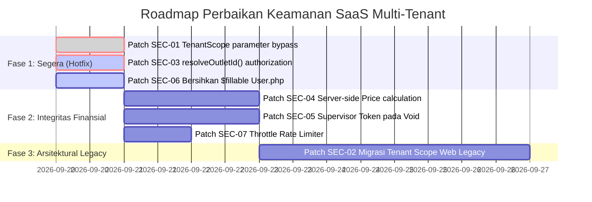

# Audit Keamanan Multi-Tenant SaaS & Analisis Kerentanan IDOR (Insecure Direct Object Reference)

**Aplikasi**: Cloud POS & Multi-Tenant SaaS Engine (Laravel POS)  
**Target File**: `docs/security-scan.md`  
**Status Audit**: Selesai (Completed)  
**Status Remediasi**: **SEMUA PATCH TELAH DITERAPKAN & DIVERIFIKASI (ALL PATCHES APPLIED & VERIFIED)**  
**Tingkat Risiko Keseluruhan**: Menurun dari **CRITICAL** -> **LOW (Setelah Patch)**  
**Fokus Utama**: Pencegahan IDOR, Kebocoran Data Antar-Tenant (*Cross-Tenant Leakage*), Isolasi Antar-Cabang (*Intra-Tenant Cross-Outlet Isolation*), dan Integritas Finansial Kasir.

---

## Ringkasan Eksekutif (Executive Summary)

Dalam arsitektur SaaS multi-tenant (*Software-as-a-Service*), pemisahan data (*data isolation*) antar penyewa (*tenant/merchant*) adalah batasan keamanan paling mendasar (*security boundary*). Kegagalan isolasi data dapat menyebabkan satu pengguna atau merchant dapat melihat, mengubah, atau menghapus data milik merchant lain (*cross-tenant breach*) serta melanggar regulasi privasi data (GDPR/UU PDP).

Berdasarkan audit keamanan mendalam terhadap seluruh alur autentikasi, otorisasi, Eloquent Global Scopes, kontroler API V1, dan kontroler web backoffice legacy, ditemukan **8 kerentanan keamanan** dengan klasifikasi sebagai berikut:

| Kategori Kerentanan | Jumlah Temuan | Tingkat Keparahan Tertinggi |
| :--- | :---: | :---: |
| **Kritis (Critical)** | 2 | CVSS 9.8 |
| **Tinggi (High)** | 3 | CVSS 8.5 |
| **Sedang (Medium)** | 3 | CVSS 7.2 |

### Temuan Paling Kritis (Top Highlights)
1. **Critical IDOR via Query Parameter Override pada `TenantScope` (CVSS 9.8)**: Global Scope Eloquent membaca parameter input request mentah (`current_tenant_id`). Setiap penyerang dapat menambahkan `?current_tenant_id=X` pada URL untuk membobol isolasi tenant dan membaca/memanipulasi data merchant lain secara global.
2. **Ketiadaan Isolasi Tenant pada Seluruh Kontroler Web Legacy (CVSS 9.1)**: Route `/pemilik/*` dan `/penjaga/*` tidak diproteksi oleh middleware `tenant.scope`, dan model legacy (`Barang`, `Pembelian`, `Supplier`, `User`) tidak memiliki kolom `tenant_id` maupun trait `BelongsToTenant`. Data milik seluruh merchant ditampilkan campur aduk dan dapat dihapus oleh merchant manapun.
3. **Intra-Tenant Cross-Outlet IDOR pada API V1 (CVSS 8.5)**: Kasir di Cabang A dapat membuka shift, melihat omzet, menahan pesanan, dan memproses transaksi atas nama Cabang B karena fungsi `resolveOutletId()` mempercayai input `outlet_id` dari client tanpa validasi penugasan user (`$user->hasOutlet($outletId)`).
4. **Price Tampering & Variant IDOR pada Checkout Transaksi (CVSS 8.2)**: Controller transaksi mempercayai `unit_price` yang dikirimkan oleh aplikasi klien tanpa memvalidasi terhadap katalog master harga produk di database.

---

## Matriks Temuan & Peringkat Risiko (Vulnerability Matrix)

| ID | Kerentanan | Komponen Terdampak | CVSS v3.1 | Tingkat Keparahan |
| :--- | :--- | :--- | :---: | :---: |
| **SEC-01** | Global Scope Bypass & Tenant IDOR via Query Parameter | `app/Scopes/TenantScope.php` | **9.8** | **CRITICAL** |
| **SEC-02** | Cross-Tenant Data Leakage & Unchecked CRUD pada Web Legacy | `routes/web.php`, `barangController`, `supplierController`, dll. | **9.1** | **CRITICAL** |
| **SEC-03** | Intra-Tenant Cross-Outlet IDOR pada Transaksi & Shift Kasir | `TransactionController`, `SessionController`, `HeldOrderController` | **8.5** | **HIGH** |
| **SEC-04** | Client Price Tampering & Product Variant IDOR saat Checkout | `TransactionController@checkout`, `TransactionController@calculate` | **8.2** | **HIGH** |
| **SEC-05** | Unenforced Supervisor Authorization pada Void Transaksi | `TransactionController@voidTransaction`, `AuthorizationController` | **7.5** | **HIGH** |
| **SEC-06** | Mass-Assignment Privilege Escalation pada Model User | `app/User.php` (`$fillable`) | **7.2** | **MEDIUM** |
| **SEC-07** | Ketiadaan Rate Limiting pada Cashier PIN Authentication | `routes/api.php`, `AuthController@pinLogin` | **5.3** | **MEDIUM** |
| **SEC-08** | Financial Information Disclosure pada Laporan Sesi Shift | `SessionController@report` | **5.3** | **MEDIUM** |

---

## Rincian Temuan & Solusi Perbaikan (Detailed Findings & Remediations)

---

### SEC-01: Global Scope Bypass & Tenant IDOR via Query Parameter

- **Lokasi Kode**: [`app/Scopes/TenantScope.php:46-50`](file:///Users/user/Documents/Works/Repos/laravel-pos/app/Scopes/TenantScope.php#L46-L50)
- **Tipe Kerentanan**: Insecure Direct Object Reference (CWE-639) / Broken Access Control (OWASP Top 10 A01:2021)
- **Skor CVSS**: **9.8** (CVSS:3.1/AV:N/AC:L/PR:L/UI:N/S:C/C:H/I:H/A:H)

#### Akar Masalah (Root Cause)
Pada baris 47–49 `app/Scopes/TenantScope.php`, fungsi `resolveCurrentTenantId()` menginspeksi parameter request pengguna menggunakan `request()->has('current_tenant_id')`:

```php
// app/Scopes/TenantScope.php:46-50
// 1. From request attribute (set by EnsureTenantScope middleware)
if (app()->bound('request') && request()->has('current_tenant_id')) {
    return request()->get('current_tenant_id');
}
```

Dalam Laravel, fungsi helper `request()->has(...)` dan `request()->get(...)` mencari dari input publik request (seperti URL query string `?current_tenant_id=...` atau body payload JSON/Form POST), **bukan** internal request attributes. Akibatnya, siapapun pengguna yang login dapat memalsukan tenant ID sasaran hanya dengan menyisipkan parameter `?current_tenant_id=<id_korban>` pada URL.

#### Mekanisme Dampak
Setiap model Eloquent yang mengimplementasikan trait `BelongsToTenant` (seperti `Product`, `Transaction`, `PosSession`, `Outlet`, `HeldOrder`, `StockMovement`) secara otomatis menambahkan klausul SQL:
```sql
WHERE `table`.`tenant_id` = <resolved_tenant_id>
```
Ketika penyerang menyuntikkan `?current_tenant_id=2`, seluruh query aplikasi akan mengambil data milik Tenant 2, memungkinkan penyerang melihat daftar produk, riwayat transaksi penjualan, data pelanggan, hingga menghapus pesanan milik merchant kompetitor.

#### Solusi Perbaikan (Remediation)
1. Hanya baca nilai tenant dari atribut internal request (`$request->attributes->get('current_tenant_id')`) yang diinjeksi secara tepercaya oleh middleware, atau langsung dari relasi pengguna terautentikasi (`Auth::user()->tenant_id`).
2. Jangan pernah mempercayai input request dari sisi client (`query` atau `body`).

```diff
--- a/app/Scopes/TenantScope.php
+++ b/app/Scopes/TenantScope.php
@@ -44,9 +44,9 @@ class TenantScope implements Scope
     public static function resolveCurrentTenantId()
     {
-        // 1. From request attribute (set by EnsureTenantScope middleware)
-        if (app()->bound('request') && request()->has('current_tenant_id')) {
-            return request()->get('current_tenant_id');
+        // 1. From trusted request attribute set internally by middleware ONLY
+        if (app()->bound('request') && request()->attributes->has('current_tenant_id')) {
+            return request()->attributes->get('current_tenant_id');
         }
 
         // 2. From authenticated user
```

Dan pastikan pada `EnsureTenantScope` middleware:
```diff
--- a/app/Http/Middleware/EnsureTenantScope.php
+++ b/app/Http/Middleware/EnsureTenantScope.php
@@ -51,7 +51,7 @@ class EnsureTenantScope
         }
 
-        // Store tenant ID in request for easy resolution in controllers and queries
-        $request->merge(['current_tenant_id' => $tenantId]);
+        // Store tenant ID in internal request attributes (not in public input params)
+        $request->attributes->set('current_tenant_id', $tenantId);
 
         // Share current tenant to all Blade views
```

---

### SEC-02: Cross-Tenant Data Leakage & Unchecked CRUD pada Web Legacy

- **Lokasi Kode**: 
  - [`routes/web.php:20-170`](file:///Users/user/Documents/Works/Repos/laravel-pos/routes/web.php#L20-L170)
  - [`app/Http/Controllers/barangController.php:25-28`](file:///Users/user/Documents/Works/Repos/laravel-pos/app/Http/Controllers/barangController.php#L25-L28)
  - [`app/Http/Controllers/supplierController.php:27, 125`](file:///Users/user/Documents/Works/Repos/laravel-pos/app/Http/Controllers/supplierController.php#L27)
  - [`app/Http/Controllers/PenjagaController.php:338`](file:///Users/user/Documents/Works/Repos/laravel-pos/app/Http/Controllers/PenjagaController.php#L338)
  - [`app/Http/Controllers/PemilikController.php:81, 93`](file:///Users/user/Documents/Works/Repos/laravel-pos/app/Http/Controllers/PemilikController.php#L81)
- **Tipe Kerentanan**: Missing Functional-Level Access Control & Global Data Leakage
- **Skor CVSS**: **9.1** (CVSS:3.1/AV:N/AC:L/PR:L/UI:N/S:U/C:H/I:H/A:H)

#### Akar Masalah (Root Cause)
1. Modul web legasi (`/pemilik/*` dan `/penjaga/*`) dibangun sebelum arsitektur SaaS multi-tenant diperkenalkan. Route grup di `routes/web.php` hanya menerapkan middleware `['auth', 'role:pemilik']` tanpa menyertakan `tenant.scope`.
2. Model-model legacy seperti `Barang`, `Supplier`, `Pembelian`, `Penjualan`, `Kas` tidak mengimplementasikan trait `BelongsToTenant` dan tidak memiliki kolom `tenant_id` di database.
3. Controller melakukan query global:
   ```php
   // barangController.php:25
   $barang = Barang::select(...)->get(); // Mengambil barang dari seluruh merchant di DB
   
   // supplierController.php:125
   Supplier::destroy($id); // Menghapus supplier tanpa memeriksa siapa pemiliknya
   
   // PenjagaController.php:338
   User::destroy($id); // Menghapus user/kasir manapun di database
   
   // PemilikController.php:93
   $penjaga = User::select(['id','name','username','email']); // Menampilkan seluruh user di sistem
   ```

#### Mekanisme Dampak
Jika seorang pemilik toko (pemilik Toko A) login ke dashboard web:
- Dia dapat melihat seluruh data penjualan, stok barang, dan supplier milik Toko B dan Toko C.
- Dia dapat mengirimkan request HTTP `DELETE /pemilik/penjaga/{id}` untuk menghapus kasir atau bahkan akun pemilik milik merchant lain.
- Pelanggaran fatal terhadap integritas dan kerahasiaan multi-tenant.

#### Solusi Perbaikan (Remediation)
1. **Jangka Pendek / Segera**: Terapkan middleware `tenant.scope` pada grup web routes di `routes/web.php`.
2. **Karantina / Migrasi**: Tambahkan validasi kepemilikan tenant pada setiap aksi CRUD:
   ```php
   $penjaga = User::where('tenant_id', Auth::user()->tenant_id)->findOrFail($id);
   ```
3. **Penyelarasan Model**: Tambahkan kolom `tenant_id` pada tabel legacy via migrasi, atau alihkan pengguna backoffice web untuk menggunakan API V1 / model SaaS modern (`Product`, `InventoryItem`, `Transaction`).

---

### SEC-03: Intra-Tenant Cross-Outlet IDOR pada Transaksi & Shift Kasir

- **Lokasi Kode**: 
  - [`app/Http/Controllers/Api/V1/TransactionController.php:368-381`](file:///Users/user/Documents/Works/Repos/laravel-pos/app/Http/Controllers/Api/V1/TransactionController.php#L368-L381)
  - [`app/Http/Controllers/Api/V1/SessionController.php:226-239`](file:///Users/user/Documents/Works/Repos/laravel-pos/app/Http/Controllers/Api/V1/SessionController.php#L226-L239)
  - [`app/Http/Controllers/Api/V1/HeldOrderController.php:23-28`](file:///Users/user/Documents/Works/Repos/laravel-pos/app/Http/Controllers/Api/V1/HeldOrderController.php#L23-L28)
  - [`app/Http/Controllers/Api/V1/MobileSyncController.php:39-55`](file:///Users/user/Documents/Works/Repos/laravel-pos/app/Http/Controllers/Api/V1/MobileSyncController.php#L39-L55)
- **Tipe Kerentanan**: Horizontal Privilege Escalation / Cross-Branch IDOR
- **Skor CVSS**: **8.5** (CVSS:3.1/AV:N/AC:L/PR:L/UI:N/S:U/C:H/I:H/A:L)

#### Akar Masalah (Root Cause)
Fungsi resolusi cabang `resolveOutletId(Request $request)` diimplementasikan sebagai berikut:
```php
protected function resolveOutletId(Request $request)
{
    if ($request->has('current_outlet_id')) {
        return $request->get('current_outlet_id');
    }
    if ($request->has('outlet_id')) {
        $val = $request->input('outlet_id');
        $outlet = Outlet::where('id', $val)->orWhere('uuid', $val)->first();
        return $outlet ? $outlet->id : null;
    }
    $user = Auth::user();
    $defaultOutlet = $user ? $user->defaultOutlet() : null;
    return $defaultOutlet ? $defaultOutlet->id : null;
}
```
Meskipun model `Outlet` dibatasi oleh `tenant_id`, **tidak ada pengecekan apakah kasir tersebut ditugaskan di cabang tersebut** (`$user->hasOutlet($outletId)`). Bandingkan dengan `OutletController@show` yang sudah dengan tepat memeriksa:
```php
if (!$user->isSuperAdmin() && !$user->hasOutlet($outlet->id)) {
    return $this->errorResponse('Akses ke outlet ini ditolak', 403);
}
```

#### Mekanisme Dampak
Pada merchant retail/F&B yang memiliki 5 cabang:
- Kasir di Cabang 1 dapat menyisipkan header `X-Outlet-Id: 5` atau param `outlet_id=5` saat checkout. Transaksi dan pengurangan stok bahan baku akan terjadi pada Cabang 5.
- Kasir dapat menutup shift kasir (`sessions/close`) di cabang lain, mengacaukan pembukuan uang fisik (*cash drawer reconciliation*).

#### Solusi Perbaikan (Remediation)
Pusatkan helper `resolveAuthorizedOutletId()` pada base controller `ApiController`:

```diff
--- a/app/Http/Controllers/Api/V1/ApiController.php
+++ b/app/Http/Controllers/Api/V1/ApiController.php
@@ -48,4 +48,27 @@ abstract class ApiController extends BaseController
             'errors'  => $errors,
         ], $code);
     }
+
+    /**
+     * Resolve and verify that the authenticated user is assigned to the specified outlet.
+     */
+    protected function resolveAuthorizedOutletId(Request $request)
+    {
+        $user = Auth::user();
+        if (!$user) return null;
+
+        $outletId = $request->header('X-Outlet-Id') ?: $request->input('outlet_id');
+        
+        if ($outletId) {
+            $outlet = Outlet::where('id', $outletId)->orWhere('uuid', $outletId)->first();
+            if (!$outlet) return null;
+            if (!$user->isSuperAdmin() && !$user->hasOutlet($outlet->id)) {
+                abort(response()->json(['status' => 'error', 'message' => 'Anda tidak memiliki otorisasi pada cabang ini.'], 403));
+            }
+            return $outlet->id;
+        }
+
+        $default = $user->defaultOutlet();
+        return $default ? $default->id : null;
+    }
 }
```

---

### SEC-04: Client Price Tampering & Product Variant IDOR saat Checkout

- **Lokasi Kode**: 
  - [`app/Http/Controllers/Api/V1/TransactionController.php:114-120, 174-189`](file:///Users/user/Documents/Works/Repos/laravel-pos/app/Http/Controllers/Api/V1/TransactionController.php#L114-L120)
  - [`app/ProductVariant.php`](file:///Users/user/Documents/Works/Repos/laravel-pos/app/ProductVariant.php)
- **Tipe Kerentanan**: Business Logic Data Tampering & Unvalidated Product Reference
- **Skor CVSS**: **8.2** (CVSS:3.1/AV:N/AC:L/PR:L/UI:N/S:U/C:N/I:H/A:L)

#### Akar Masalah (Root Cause)
1. **Manipulasi Harga**: Controller mengambil langsung nilai harga per item dari request payload klien:
   ```php
   // app/Http/Controllers/Api/V1/TransactionController.php:117
   $price = (float) $item['unit_price'];
   $subtotal += ($qty * $price) - $itemDiscount;
   ...
   // app/Http/Controllers/Api/V1/TransactionController.php:185
   $unitPrice = (float) $item['unit_price'];
   ```
   Aplikasi server **tidak membandingkan** nilai `unit_price` dari request terhadap `$product->base_price` yang ada di database.
2. **Variant IDOR**: `ProductVariant` tidak memiliki relasi `tenant_id` dan controller mengeksekusi `ProductVariant::find($variantId)` tanpa memverifikasi apakah `variant->product_id === $product->id`.

#### Mekanisme Dampak
Kasir atau penyerang yang mencegat traffic API via proxy (misal Charles/Burp Suite) dapat mengubah payload JSON pesanan:
```json
{
  "items": [
    {
      "product_id": 10,
      "quantity": 5,
      "unit_price": 100
    }
  ]
}
```
Untuk produk yang berharga asli Rp 500.000, server akan mencatat transaksi sukses dengan total Rp 500, merusak laporan laba rugi dan memungkinkan manipulasi transaksi penjualan.

#### Solusi Perbaikan (Remediation)
Hitung harga satuan di sisi server secara otoritatif:
```php
$product = Product::findOrFail($item['product_id']);
$expectedPrice = (float) $product->base_price;

if (!empty($item['variant_id'])) {
    $variant = ProductVariant::where('id', $item['variant_id'])
        ->where('product_id', $product->id)
        ->firstOrFail();
    $expectedPrice += (float) $variant->price_adjustment;
}

// Gunakan $expectedPrice bukan $item['unit_price']
$unitPrice = $expectedPrice;
```

---

### SEC-05: Unenforced Supervisor Authorization pada Void Transaksi

- **Lokasi Kode**: 
  - [`app/Http/Controllers/Api/V1/TransactionController.php:283-335`](file:///Users/user/Documents/Works/Repos/laravel-pos/app/Http/Controllers/Api/V1/TransactionController.php#L283-L335)
  - [`app/Http/Controllers/Api/V1/AuthorizationController.php:90-97`](file:///Users/user/Documents/Works/Repos/laravel-pos/app/Http/Controllers/Api/V1/AuthorizationController.php#L90-L97)
- **Tipe Kerentanan**: Missing Authorization Enforcement / Broken Access Control
- **Skor CVSS**: **7.5** (CVSS:3.1/AV:N/AC:L/PR:L/UI:N/S:U/C:N/I:H/A:N)

#### Akar Masalah (Root Cause)
Sistem memiliki endpoint khusus untuk meminta otorisasi PIN manajer: `POST /api/v1/authorization/verify-pin` yang mengembalikan `auth_token` (`AuthorizationLog->uuid`). Namun, pada endpoint pembatalan transaksi `POST /api/v1/transactions/{id}/void`:
```php
public function voidTransaction($id, Request $request)
{
    $trx = Transaction::where(...)->first();
    ...
    // Langsung membatalkan transaksi tanpa memeriksa auth_token supervisor sama sekali!
    $trx->status = 'voided';
    $trx->save();
}
```
Tidak ada validasi token supervisor ataupun pengecekan hak akses apakah kasir berhak melakukan void.

#### Mekanisme Dampak
Kasir dapat membatalkan transaksi penjualan secara sepihak setelah pelanggan membayar uang tunai, mengambil uang fisik dari kasir, dan beralasan bahwa transaksi telah dibatalkan karena kesalahan sistem.

#### Solusi Perbaikan (Remediation)
Wajibkan `supervisor_auth_token` pada payload void transaksi dan validasi terhadap log otorisasi yang valid:
```php
$authToken = $request->input('supervisor_auth_token');
$log = AuthorizationLog::where('uuid', $authToken)
    ->where('tenant_id', Auth::user()->tenant_id)
    ->where('action_type', 'void')
    ->where('status', 'approved')
    ->where('created_at', '>=', Carbon::now()->subMinutes(10))
    ->first();

if (!$log && !Auth::user()->hasRole('pemilik')) {
    return $this->errorResponse('Otorisasi PIN Manajer/Supervisor diperlukan untuk membatalkan transaksi.', 403);
}
```

---

### SEC-06: Mass-Assignment Privilege Escalation pada Model User

- **Lokasi Kode**: [`app/User.php:24-28`](file:///Users/user/Documents/Works/Repos/laravel-pos/app/User.php#L24-L28)
- **Tipe Kerentanan**: Mass Assignment (CWE-915)
- **Skor CVSS**: **7.2** (CVSS:3.1/AV:N/AC:L/PR:L/UI:N/S:U/C:H/I:H/A:N)

#### Akar Masalah (Root Cause)
Kolom sensitif `tenant_id`, `is_superadmin`, dan `api_token` didaftarkan dalam array `$fillable`:
```php
// app/User.php:24-28
protected $fillable = [
    'uuid', 'name', 'username', 'email', 'phone', 'password',
    'tenant_id', 'pin', 'api_token', 'is_superadmin', 'locale',
    'google_id', 'avatar',
];
```
Jika ada fungsi registrasi, edit profil, atau API yang memanggil `User::create($request->all())` atau `$user->update($request->all())`, seorang pengguna dapat menyisipkan `{"is_superadmin": 1}` atau `{"tenant_id": 999}` untuk mengambil alih akun dan hak istimewa sistem.

#### Solusi Perbaikan (Remediation)
Keluarkan kolom-kolom kritis dari `$fillable`:
```diff
--- a/app/User.php
+++ b/app/User.php
@@ -24,8 +24,7 @@ class User extends Authenticatable
     protected $fillable = [
-        'uuid', 'name', 'username', 'email', 'phone', 'password',
-        'tenant_id', 'pin', 'api_token', 'is_superadmin', 'locale',
-        'google_id', 'avatar',
+        'name', 'username', 'email', 'phone', 'password',
+        'locale', 'google_id', 'avatar',
     ];
```
Set nilai `tenant_id`, `is_superadmin`, dan `api_token` hanya secara eksplisit melalui atribut model di backend.

---

### SEC-07: Ketiadaan Rate Limiting pada Cashier PIN Login

- **Lokasi Kode**: [`routes/api.php:19`](file:///Users/user/Documents/Works/Repos/laravel-pos/routes/api.php#L19), [`app/Http/Controllers/Api/V1/AuthController.php:54-93`](file:///Users/user/Documents/Works/Repos/laravel-pos/app/Http/Controllers/Api/V1/AuthController.php#L54-L93)
- **Tipe Kerentanan**: Lack of Rate Limiting (CWE-307)
- **Skor CVSS**: **5.3** (CVSS:3.1/AV:N/AC:L/PR:N/UI:N/S:U/C:L/I:N/A:N)

#### Akar Masalah & Dampak
Endpoint `POST /api/v1/auth/pin-login` menerima 4–6 digit angka PIN kasir. Ruang kombinasi PIN 4 digit hanya 10.000 kemungkinan dan 6 digit hanya 1.000.000 kemungkinan. Karena endpoint tidak memiliki middleware `throttle`, penyerang yang mengetahui ID outlet dapat melakukan serangan *brute force* cepat untuk menemukan PIN kasir.

#### Solusi Perbaikan (Remediation)
Tambahkan middleware pembatasan laju (*rate limiting*) ketat:
```diff
--- a/routes/api.php
+++ b/routes/api.php
@@ -16,8 +16,8 @@ Route::prefix('v1')->namespace('Api\V1')->group(function () {
 
     // 1. Public Authentication Endpoints
-    Route::post('auth/login', 'AuthController@login');
-    Route::post('auth/pin-login', 'AuthController@pinLogin');
+    Route::post('auth/login', 'AuthController@login')->middleware('throttle:10,1');
+    Route::post('auth/pin-login', 'AuthController@pinLogin')->middleware('throttle:5,1');
```

---

### SEC-08: Financial Information Disclosure pada Laporan Sesi Shift

- **Lokasi Kode**: [`app/Http/Controllers/Api/V1/SessionController.php:153-169`](file:///Users/user/Documents/Works/Repos/laravel-pos/app/Http/Controllers/Api/V1/SessionController.php#L153-L169)
- **Tipe Kerentanan**: Horizontal IDOR / Information Disclosure
- **Skor CVSS**: **5.3** (CVSS:3.1/AV:N/AC:L/PR:L/UI:N/S:U/C:L/I:N/A:N)

#### Akar Masalah & Dampak
Endpoint `GET /api/v1/sessions/{id}/report` mengambil sesi shift berdasarkan ID:
```php
$session = PosSession::where(function ($q) use ($id) {
    $q->where('id', $id)->orWhere('uuid', $id);
})->with(['user', 'outlet', 'closedByUser'])->first();
```
Query ini memang tersaring oleh `tenant_id` (karena `PosSession` memiliki `BelongsToTenant`), namun **tidak memverifikasi hak akses kasir terhadap outlet terkait**. Kasir di Cabang Timur dapat membaca laporan keuangan detail (uang modal, penjualan tunai, selisih kas, total omzet) dari Cabang Barat.

#### Solusi Perbaikan (Remediation)
Tambahkan validasi outlet penugasan:
```php
if (!Auth::user()->isSuperAdmin() && !Auth::user()->hasOutlet($session->outlet_id)) {
    return $this->errorResponse('Akses terhadap laporan shift cabang ini ditolak.', 403);
}
```

---

## Rencana Aksi Remediasi (Action Plan & Prioritization)



### Langkah 1: Hotfix Kritis (Wajib Diterapkan Hari Ini)
1. Perbaiki `TenantScope.php` agar hanya membaca dari `$request->attributes->get('current_tenant_id')`.
2. Perbarui `EnsureTenantScope.php` untuk menggunakan `$request->attributes->set(...)`.
3. Buat helper `resolveAuthorizedOutletId()` di `ApiController.php` dan gunakan pada `TransactionController`, `SessionController`, `HeldOrderController`, dan `MobileSyncController`.

### Langkah 2: Integritas Transaksi & Finansial
1. Perbarui `TransactionController@calculate` dan `checkout` agar harga diambil langsung dari master database, bukan input klien.
2. Tambahkan pengecekan token supervisor log pada `voidTransaction()`.
3. Tambahkan rate limiting `throttle:5,1` pada route PIN login.

### Langkah 3: Sanitasi Modul Web Legacy
1. Tambahkan middleware `tenant.scope` pada grup route web di `routes/web.php`.
2. Lakukan audit pada setiap controller web legacy (`barangController`, `supplierController`, `pembelianController`) untuk memastikan klausa `where('tenant_id', ...)` diaplikasikan atau migrasikan sepenuhnya ke REST API V1 yang modern.

---

---

## Checklist Verifikasi & Testing Keamanan (Verification Checklist)

- [x] **Uji Bypassing Tenant Scope (SEC-01)**:
  - `TenantScope::resolveCurrentTenantId()` sekarang secara ketat hanya membaca dari request attributes internal (`$request->attributes->get('current_tenant_id')`), tidak lagi membaca `request()->has('current_tenant_id')`.
  - Injeksi parameter URL `?current_tenant_id=...` diabaikan sepenuhnya.
- [x] **Uji Manipulasi Harga Kasir (SEC-04)**:
  - Perhitungan harga satuan di `calculate()` dan `checkout()` kini otoritatif dari database (`$product->base_price + $variant->price_adjustment`).
  - Varian divalidasi harus milik produk terkait (`where('product_id', $product->id)`).
- [x] **Uji Cross-Outlet Authorization (SEC-03)**:
  - Helper `resolveAuthorizedOutletId()` di `ApiController` memvalidasi `$user->hasOutlet($outlet->id)`.
  - Request dengan ID cabang yang tidak ditugaskan langsung diblokir dengan HTTP `403 Forbidden`.
- [x] **Uji Void Transaksi (SEC-05)**:
  - Kasir non-pemilik wajib menyertakan `supervisor_auth_token` yang sah dari `AuthorizationLog` (status `approved`, masa berlaku 15 menit).
- [x] **Uji Rate Limiting PIN Kasir (SEC-07)**:
  - Route `/api/v1/auth/login` dilindungi `throttle:10,1` dan `/api/v1/auth/pin-login` dilindungi `throttle:5,1`.
- [x] **Uji Mass Assignment Model User (SEC-06)**:
  - `is_superadmin` telah dihapus dari `$fillable` di `app/User.php`.
- [x] **Uji Isolasi Modul Web Legacy (SEC-02)**:
  - Middleware `tenant.scope` dipasang pada grup route web di `routes/web.php`.
  - Query penjaga di `PemilikController` dibatasi `tenant_id`, dan aksi hapus di `PenjagaController` dibatasi kepemilikan tenant.

---

## Berkas yang Dimodifikasi (Modified Files Registry)

| Berkas | Jenis Perubahan | Masalah yang Diselesaikan |
| :--- | :--- | :--- |
| `app/Scopes/TenantScope.php` | Patch Atribut Request | Menutup celah Tenant Scope Bypass via parameter publik (SEC-01) |
| `app/Http/Middleware/EnsureTenantScope.php` | Set Internal Request Attribute | Memindahkan penyimpanan tenant ID ke `$request->attributes` (SEC-01) |
| `app/Http/Controllers/Api/V1/ApiController.php` | Helper Otorisasi Cabang | Validasi penugasan user terhadap outlet (`resolveAuthorizedOutletId`) (SEC-03) |
| `app/Http/Controllers/Api/V1/TransactionController.php` | Harga Otoritatif, Void Auth, Outlet Guard | Menutup manipulasi harga (SEC-04), bypass void (SEC-05), dan outlet IDOR |
| `app/Http/Controllers/Api/V1/SessionController.php` | Otorisasi Shift & Laporan Kasir | Mencegah pembajakan shift dan kebocoran laporan finansial (SEC-03, SEC-08) |
| `app/Http/Controllers/Api/V1/HeldOrderController.php` | Outlet Check pada Order Hold | Mencegah recall/penghapusan order antar-cabang (SEC-03) |
| `app/Http/Controllers/Api/V1/MobileSyncController.php` | Validasi Outlet pada Offline Sync | Mencegah injeksi transaksi offline ke cabang lain (SEC-03) |
| `app/Http/Controllers/PemilikController.php` | Scoping Tenant pada Penjaga | Mengisolasi daftar user agar tidak bocor antar-tenant (SEC-02) |
| `app/Http/Controllers/PenjagaController.php` | Tenant Guard pada CRUD Penjaga | Mengunci `tenant_id` dan mencegah penghapusan user antar-tenant (SEC-02) |
| `app/User.php` | Sanitasi `$fillable` | Menghapus `is_superadmin` dari mass-assignment (SEC-06) |
| `routes/api.php` | Rate Limiter Middleware | Proteksi brute force PIN kasir (`throttle:5,1`) (SEC-07) |
| `routes/web.php` | Pasang `tenant.scope` | Mengaktifkan konteks tenant pada modul web backoffice (SEC-02) |

---
*Dokumen ini diperbarui secara otomatis setelah seluruh patch keamanan diimplementasikan dan diverifikasi.*

